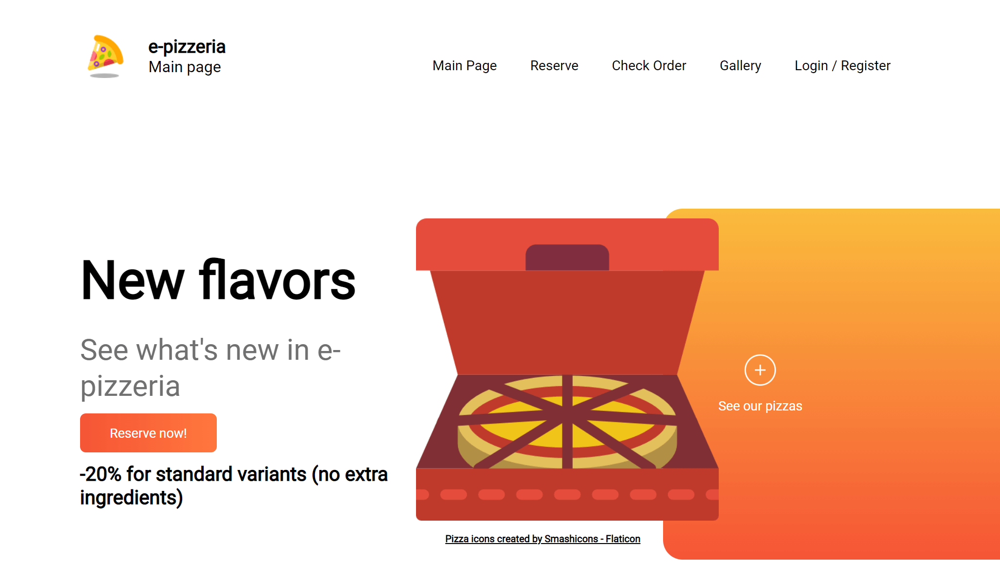
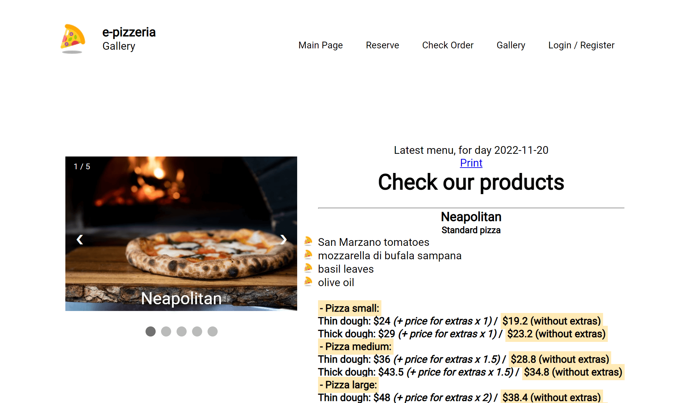
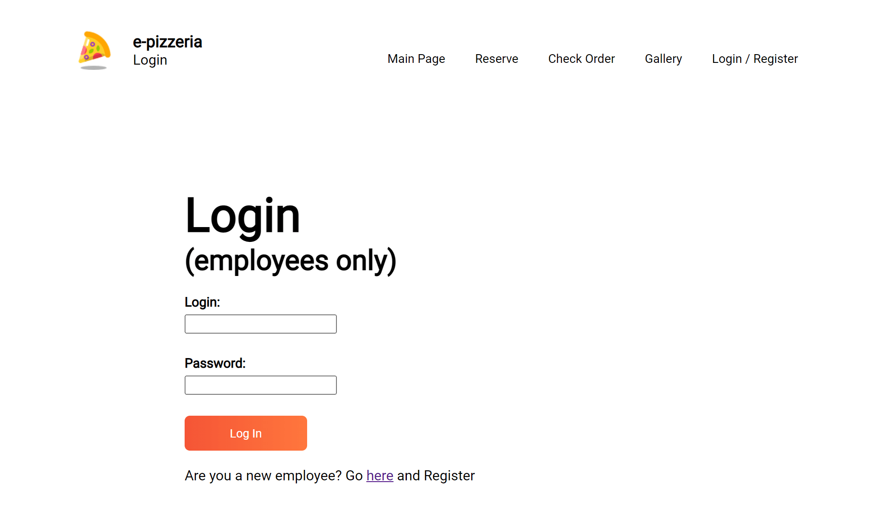
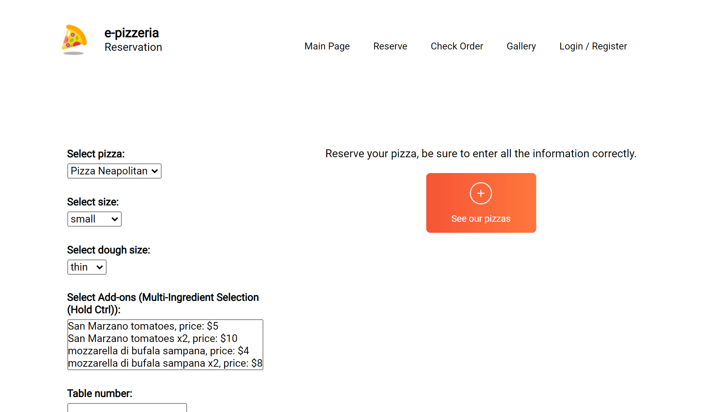
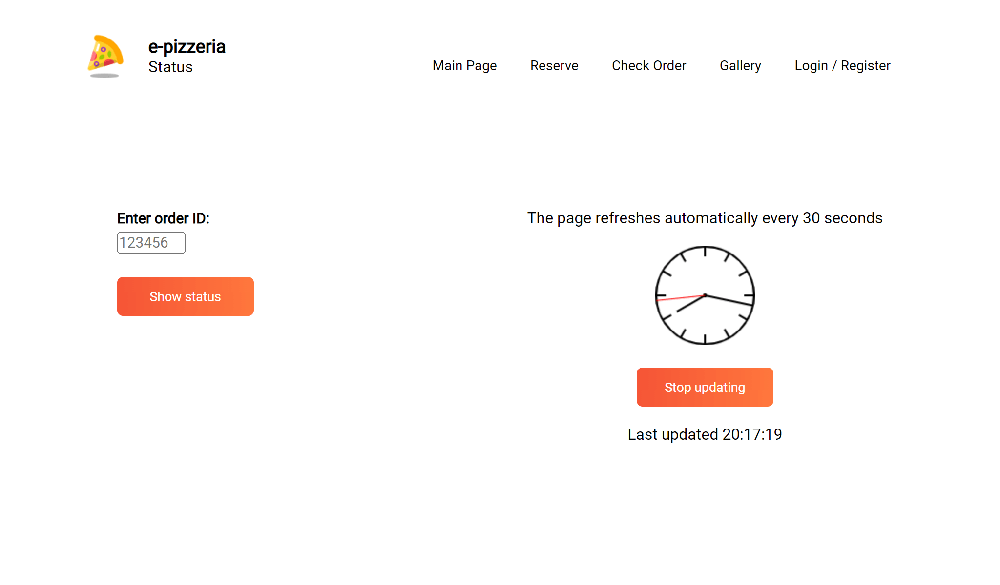
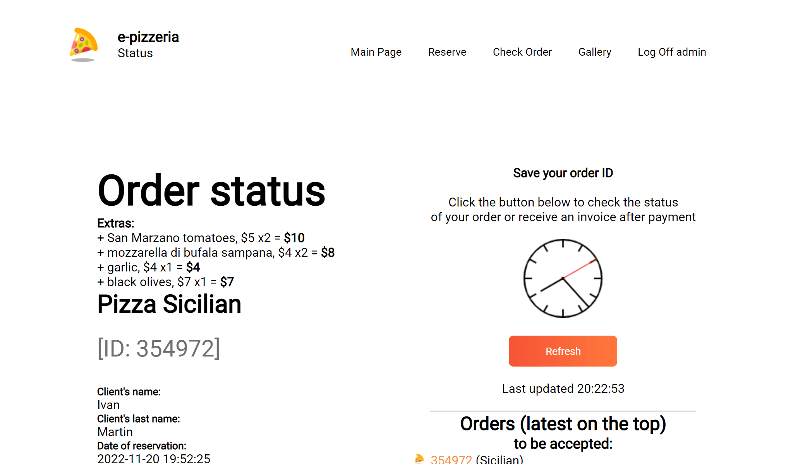
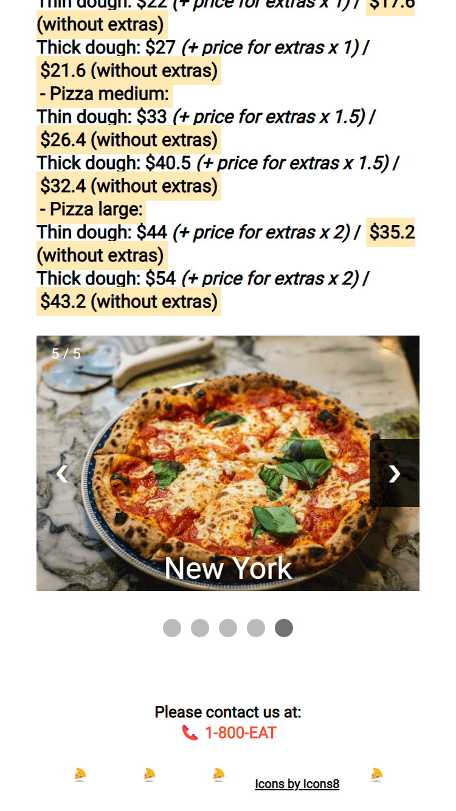
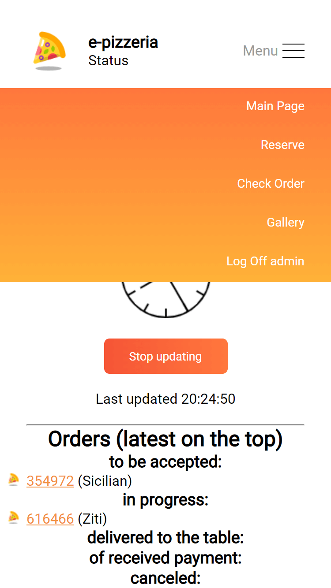
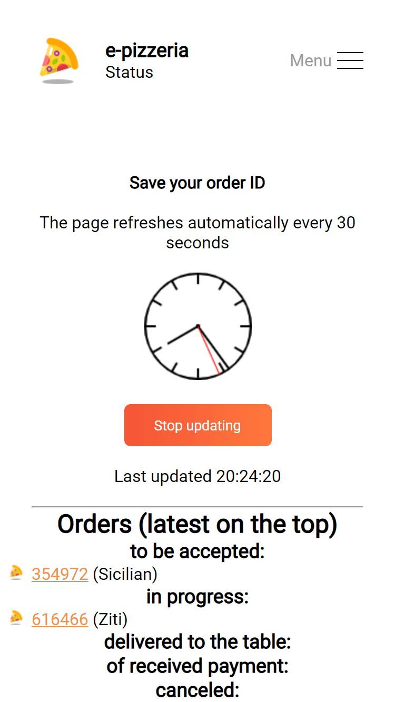

# e-pizzeria

## Features

<p float="left">









</p>

## Configuration (for Windows) - easy version

- [ ] Install XAMPP from https://www.apachefriends.org/index.html

- [ ] Copy project's folder into XAMPP's htdocs folder

- [ ] Run Apache and MySQL server on XAMPP

- [ ] Then enter SQL commands to create the database (**SQL commands** section)

Commands can be inserted at `http://localhost/phpmyadmin/index.php?route=/server/sql`

- [ ] Connect browser to local web server at address `http://localhost/project-folder-with-index-php-inside/`

## Configuration (for Windows) - advanced version

**Download binaries of servers:**

- [ ] Download and unzip PHP archive - required for web server

- [ ] Download and unzip MariaDB archive - required for SQL server

**Configure PHP .ini file:**

- [ ] Rename *php.ini-production* or *php.ini-development* to *php.ini*

- [ ] Uncomment lines from the *php.ini*:

```ini
; before
;extension=mysqli
;extension_dir = "ext"

; after
extension=mysqli
extension_dir = "ext"
```

**Run PHP server - specify website directory**

```powershell
C:\php_unpack\directory> php.exe -S localhost:8080 C:\server_files\
```

**Prepare and run SQL server**

```powershell
C:\mariadb_unpack\directory> bin\mysqld_install_db.exe 
C:\mariadb_unpack\directory> bin\mysqld.exe --console
```

- [ ] Connect to SQL command line
```powershell
C:\mariadb_unpack\directory> mysql.exe -u root -p
```

- [ ] Then enter SQL commands to create the database (**SQL commands** section)

**Connect browser to local web server**
```
localhost:8080
```

## SQL commands to create database

```sql
DROP DATABASE IF EXISTS pizzeria;
CREATE DATABASE pizzeria;
use pizzeria;

CREATE TABLE ingredients (
    id_ingredient INT(3) AUTO_INCREMENT, 
    name VARCHAR(40), 
    price float, 
    PRIMARY KEY(id_ingredient)
    );

CREATE TABLE dough_types (
    id_dough INT(1) AUTO_INCREMENT, 
    dough_type VARCHAR(20),
    price float,
    PRIMARY KEY(id_dough)
    );

CREATE TABLE dough_size (
    id_size INT(1) AUTO_INCREMENT, 
    size VARCHAR(20), 
    proportion float, 
    PRIMARY KEY(id_size)
    );

CREATE TABLE extras (
    id_ingredient INT(3), 
    id_order INT(11), 
    proportion int(1)
    );

CREATE TABLE recipes (
    id_pizza INT(11), 
    id_ingredient INT(3)
    );

CREATE TABLE clients (
    id_client INT(5) AUTO_INCREMENT, 
    name VARCHAR(20), 
    last_name VARCHAR(20), 
    PRIMARY KEY(id_client)
    );

CREATE TABLE messages (
    id_msg INT(11) AUTO_INCREMENT, 
    message VARCHAR(255), 
    PRIMARY KEY(id_msg)
    );

CREATE TABLE pizza_types (
    id_pizza INT(11) AUTO_INCREMENT, 
    name VARCHAR(64), 
    url VARCHAR(512), 
    is_standard TINYINT(1), 
    PRIMARY KEY(id_pizza)
    );

CREATE TABLE orders (
    id_order INT(11), 
    id_pizza INT(11), 
    id_client INT(5), 
    id_employee INT(5), 
    date TIMESTAMP DEFAULT(CURRENT_TIMESTAMP), 
    order_status INT(1) DEFAULT(0), 
    id_msg INT(11), 
    bill_needed TINYINT(1) DEFAULT(0), 
    table_num INT(3),
    id_dough INT(1), 
    id_size INT(1), 
    PRIMARY KEY(id_order)
    );

CREATE TABLE users (
    login VARCHAR(20), 
    password VARCHAR(40), 
    id_client INT(5), 
    PRIMARY KEY(login)
    );

INSERT INTO pizza_types(name,url,is_standard) VALUES 
("Neapolitan","images/pizza/nik-owens-40OJLYVWeeM-unsplash.jpg",1), 
("Bianca","images/pizza/jonas-kakaroto-zlKdLdMREtE-unsplash.jpg",1),
("Sicilian","images/pizza/ivan-torres-MQUqbmszGGM-unsplash.jpg",1),
("Ziti","images/pizza/carissa-gan-_0JpjeqtSyg-unsplash.jpg",1),
("New York","images/pizza/aurelien-lemasson-theobald-x00CzBt4Dfk-unsplash.jpg",1)
;

INSERT INTO ingredients(id_ingredient, name, price) VALUES
(1, "San Marzano tomatoes",5),
(2, "mozzarella di bufala sampana",4),
(3, "basil leaves",3),
(4, "olive oil",2),
(5, "milk sauce", 4),
(6, "rosemary leaves",3),
(7, "garlic",4),
(8, "black olives",7),
(9, "arugula",3),
(10, "al dente pasta",2),
(11, "cheese mix",5),
(12, "tomato sauce",3),
(13, "ricotta",7),
(14, "high gluten flour",4),
(15, "New York water",5)
;

INSERT INTO recipes(id_pizza, id_ingredient) VALUES
(1,1),
(1,2),
(1,3),
(1,4),
(2,5),
(2,6),
(2,7),
(3,8),
(3,9),
(4,10),
(4,11),
(4,12),
(4,13),
(4,2),
(5,14),
(5,15),
(5,9)
;

INSERT INTO dough_types(dough_type, price) VALUES
("thin", 10),
("thick", 15)
;

INSERT INTO dough_size(size, proportion) VALUES
("small",1),
("medium",1.5),
("large",2)
;
```
